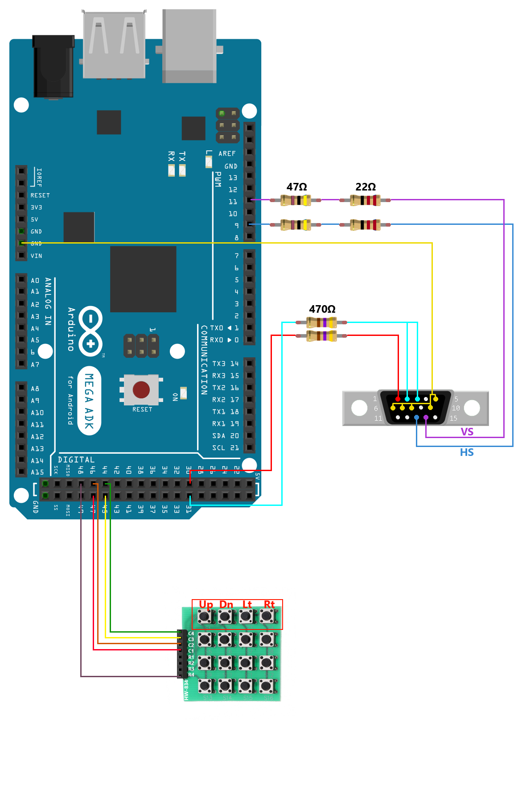

# Arduino Snake

 ## Components used 
    * Arduino MEGA 2560 R3
    * VGA Cable 
    * 4x4 Button Matrix (HW-834)

 ## Schematic
 
 
 ## Project functionality 
 The main Arduino library used for this project is VGAx that generates the corresponding frequency for the HS and VS signals and helps with the screen drawing and rendering process.
 * The project has 2 versions: one with the snake dying from the red walls and one with the snake teleporting on the other side of the wall  
 * The snake can eat 2 types of food:  
    * Poison: cuts down the size of the snake 
    * Apple: enlarges the snake 
 * The food is generated randomly based on the snake position 
 * The food is regenerated after a random generated time, between 1 and 5 seconds (configurable) 
 * Death of the snake can occur in 2 scenarios: 
    * Eating poison while the snake has the smallest possible size 
    * Eating its own tail 
 * The texture of the snake and food can be changed easily by using some code generation tools from the VGAx library 

 ## Useful links
 https://github.com/smaffer/vgax 

 https://learn.digilentinc.com/Documents/269 

 https://simple-circuit.com/interfacing-arduino-vga-example/ 

 http://www.sandromaffiodo.com/ 
